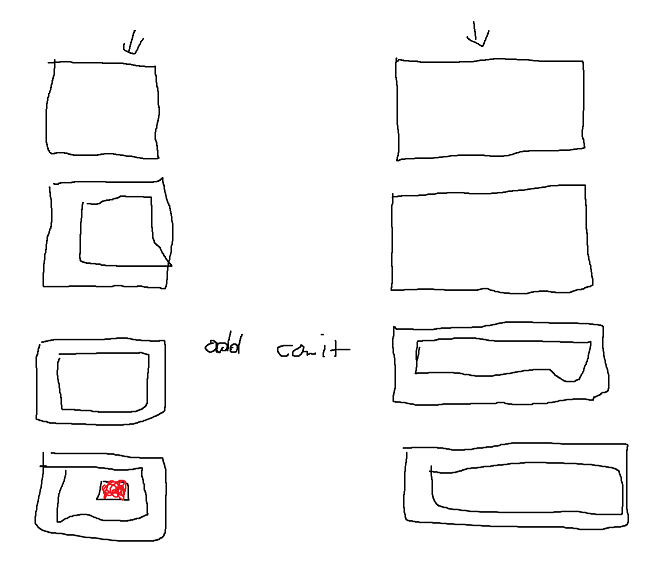

# Project Name

Project Description

### Column Name

- [ ] Task title ~3d #type @name yyyy-mm-dd
  - [ ] Sub-task or description

### Do zrobienia GITlike

#### gitlike

1. Robimy zwykły program w python który trzeba dodać do
   zmiennych środowiskowych
   podajemy ścieżkę i ma znaleść plik o nazwie .gitlike
2. Komendy
   - init dodaje folder .gitlike
   - add dodaje do śledzenia wszystkie/wybrane pliki
   - log
   - status
   - push
     
